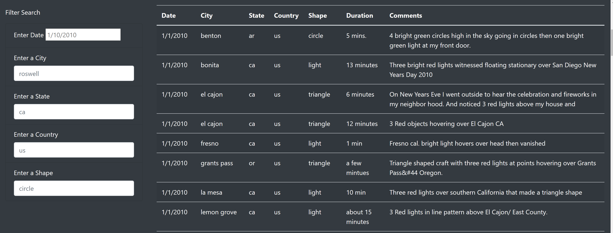
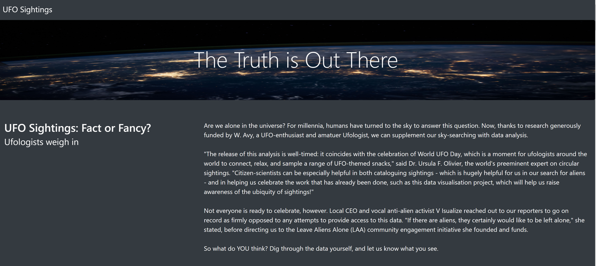

# UFOs
## Overview Of Project

- Dana’s webpage and dynamic table are working as intended, but she’d like to provide a more in-depth analysis of UFO sightings by allowing users to filter for multiple criteria at the same time. In addition to the date, you’ll add table filters for the city, state, country, and shape.

- The customer will see the fundamental opening and title with an image at the highest point of the site, as the customer looks down, they will start to see all the information and channels. There are 5 unique channels to look over; the date, city, state, country and shape. You can choose any of the channels and write in the pursuit bar, the HTML page will create the sightings for the hunt rules you entered. There can be various channels entered simultaneously to additional limited down the information to a particular pursuit standards.

 ## Summary
 
- There are two downsides to the plan. One downside is attempting to approve the sightings that happened which can be better portrayed in the information. Another downside is that we don't have any observer information. The suggestions I would prescribe is to assemble more information to give, for example, witness accounts and the other proposal would add more channel like length of locating.

